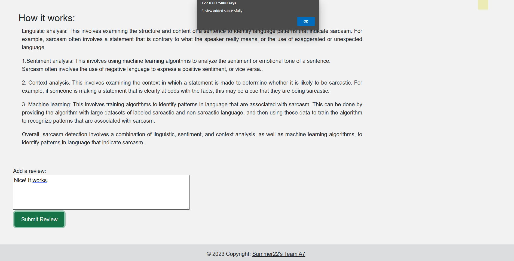

# Sarcasm Detection  App

This is a Sarcasm Detection App built using Natural Language Processing (NLP) techniques. The app analyzes text input and predicts whether the given text is sarcastic or not.

## Prerequisites

Before running the application, make sure you have the following installed:

- Python (version 3.6 or higher)
- Flask (install via pip: `pip install flask`)

## Installation

1. Clone the repository to your local machine using the following command:

2. Navigate to the project directory:

3. Create a virtual environment (optional but recommended) to isolate project dependencies:

The Flask app should now be running, and you should see the application's homepage.

##ScreenShots of my Project:

